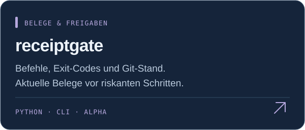
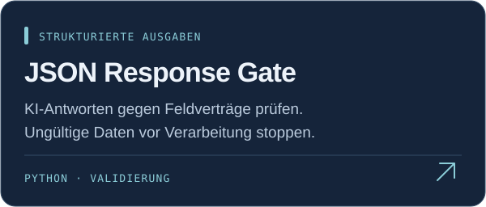
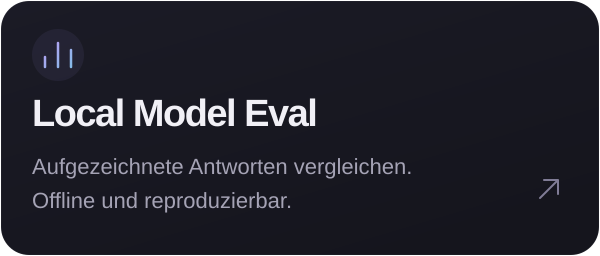
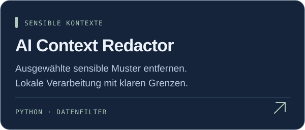

  

Ich entwickle eigene Softwarelösungen für **lokale KI und automatisierte Abläufe**.
Hier zeige ich kleine Werkzeuge, die du selbst ausprobieren und prüfen kannst.

 

### Kleine Werkzeuge. Klare Aufgaben.

<a href="https://github.com/luminosstudioai-creator/receiptgate"><picture><source media="(max-width: 600px)" srcset="assets/receiptgate-mobile.svg" /></picture></a>
<a href="https://github.com/luminosstudioai-creator/json-response-gate"><picture><source media="(max-width: 600px)" srcset="assets/json-response-gate-mobile.svg" /></picture></a>
 
<a href="https://github.com/luminosstudioai-creator/local-model-eval"><picture><source media="(max-width: 600px)" srcset="assets/local-model-eval-mobile.svg" /></picture></a>
<a href="https://github.com/luminosstudioai-creator/ai-context-redactor"><picture><source media="(max-width: 600px)" srcset="assets/ai-context-redactor-mobile.svg" /></picture></a>

Python · Lokal ausführbar · Mit Tests und synthetischen Beispielen

Die Projekt-READMEs enthalten Demos, Testbefehle und Einschränkungen. Receiptgate ist eine **Alpha**; die Agentenintegration ist noch experimentell.

 

### Lass uns sprechen.

Offen für **Remote-Anstellungen** in KI-Integration und Automatisierung — auch Teilzeit oder Minijob.

**[Auf LinkedIn kontaktieren ↗](https://www.linkedin.com/in/mika-mischke/)**
